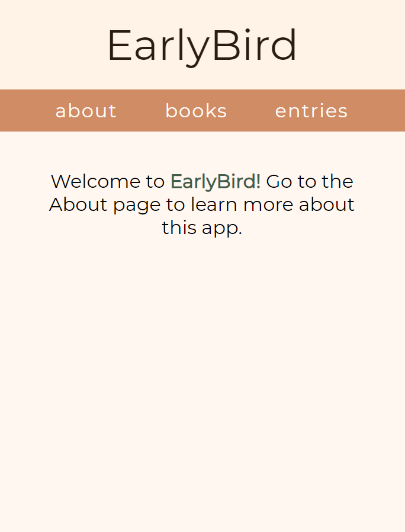
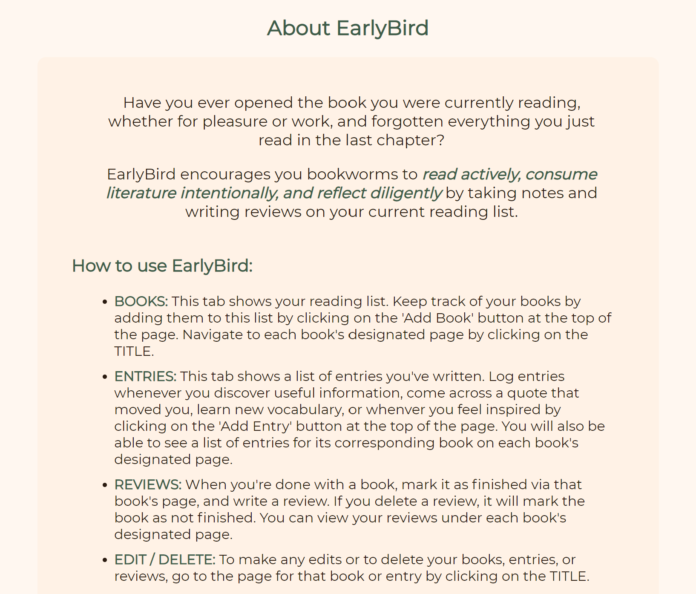
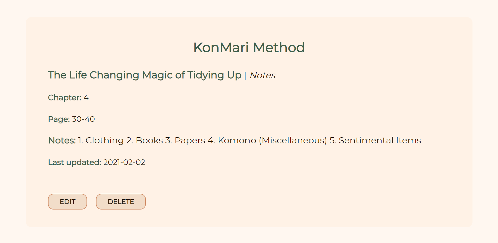

# EarlyBird

## About the App

EarlyBird is a book tracking and journaling app that encourages you bookworms to read actively, consume literature intentionally, and reflect diligently by taking notes and writing reviews on your current reading list.

---

## Pages

### Home Page

### About Page

### List of Books

### Book Page

### Entry Page

---

## [API Documentation](https://hidden-atoll-11404.herokuapp.com/)

### Endpoints

#### /api/books

- GET: returns all of the user's books
- POST: add a book

#### /api/books/:book_id

- PATCH: update information for a specified book
- DELETE: delete a specified book

#### /api/entries

- GET: returns all of the user's entries
- POST: add a visit

#### /api/entries/:entry_id

- PATCH: update information for a specified entry
- DELETE: delete a specified entry

#### /api/reviews

- GET: returns all of the user's book reviews
- POST: add a book review

#### /api/reviews/:review_id

- PATCH: update information for a specified book review
- DELETE: delete a specified book review

---

### Technology Used:

- HTML
- CSS
- JavaScript
- ReactJS
- NodeJS
- Express
- PostgreSQL

---

### Aspiring Features:

- Ability to add new categories to entries
- Show cover photo of each book on their designated pages (fetch data from Google Books API)
- Show a list of suggested books that are similar to reads that you enjoyed or marked that you would recommend
- Search / filter function when viewing the list of books and entries
- User authentication to allow the app to be used as a social platform / for book clubs
